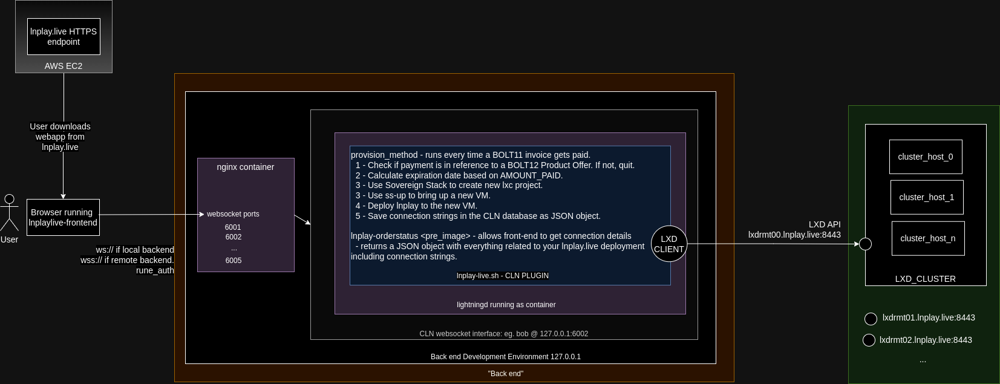

# lnplay.live requirements

This is what we intend to accomplish as a MINIMUM VIABLE PRODUCT for the tabconf-2023 hackathon. `lnplay.live` is a public website allowing anyone to purchase (via lightning-only) an ephemeral regtest lightning environment called [`lnplay`](https://github.com/farscapian/lnplay) that can be used to educate bitcoin meetups, bitcoin conferences, board-rooms, etc. It's a fun an educational experience helpful in orange-pilling your target audience.

# Product Definition

|PRODUCT_SKU|CLN_COUNT|PRICE (msats/node-hour)|REQUIRED/OPTIONAL|
|---|---|---|---|
|A|8|200000|REQUIRED|
|B|16|220000|OPTIONAL|
|C|32|240000|OPTIONAL|
|D|64|260000|OPTIONAL|

Once the BOLT11 invoice is paid, the user should be directed to a unique URL based on the `invoice_id` under `/orders/<invoice_id>`. They should be asked to store the URL in their in their password manager.

> OPTIONAL Feature - Web app creates QR codes and/or PDF printouts of connection info.

# lnplay-frontend [captain: banterpanther]

The front-end is a [lnmessage-enabled](https://github.com/aaronbarnardsound/lnmessage) PWA that interfaces with a backend core lightning node (CLN) over the `--experimental-websocket-port` (HTTP for local, 443/HTTPS/TLS-1.3 for remote hosts). It's what you will when you visit `https://lnplay.live`.

## Copy

The frontend should have a section which describes the product offering and convinces potential customers to buy.

# lnplay-backend [captain: farscapian]

The backend consists of the following efforts:

## Rune

A rate-limited rune and restricted rune needs to [be issued](https://github.com/farscapian/lnplay/blob/tabconf/get_rune.sh) by the back end (admin rune OK for demo). This rune gets embedded in the front-end and is used for authenticating client requests to the backend websocket endpoint. Method authorization should be whitelist rpc methods starting with `lnplaylive-`. The front-end application SHOULD accept this rune at build-time if possible.

## Infrastructure (REQUIRED) - aka 'cluster'

A LXD cluster providing compute, memory, networking, and storage is accessible at `lxdrmt00.lnplay.live:8443` [LXD API](https://documentation.ubuntu.com/lxd/en/latest/search/?q=API&check_keywords=yes&area=default) (access is IP white-listed). The LXC client in the provisioning plugin accesses this service to create projects, provision VMs, and deploy [`lnplay`](https://github.com/farscapian/lnplay/tree/tabconf). The provisioning process also requires SSH access to any VMs that get created.

> Note: lnplay.live services scales by adding additional LXD clusters.
## CLN Provisioning Plugin (REQUIRED)

[A cln plugin](https://github.com/farscapian/lnplay.live-plugin) written in python having three main functions:  
  
  a. an rpc method `lnplaylive-createorder -k node_count=8 hours=48` that returns a BOLT11 invoice that can be paid by the customer. The API should accept at a minimum the node_count and number of hours the environment should be available.

  b. an rpcmethod `lnplaylive-invoicestatus -k payment_type=bolt11 invoice_id=<invoice_id>` that returns the status of an invoice. The front end can poll this method and display connection strings when they become available. The deployment status becomes available AFTER the invoice is paid. Connection details become available AFTER provisioning scripts have completed (estimated 3-5 minutes).

  c. code that that gets [executed whenever a BOLT11 invoice is paid](https://docs.corelightning.org/docs/event-notifications#invoice_payment). The plugin will determine if the payment is associated with an `lnplay.live` order. If it is, the following occurs:

  > 1. when running for the first time, a new [remote](https://documentation.ubuntu.com/lxd/en/latest/reference/manpages/lxc/remote/#synopsis) will need to be created. This is achieved by passing in environment variables and/or using [docker secrets](https://docs.docker.com/compose/compose-file/compose-file-v3/#configs). Assuming the LXD remote connection information is correct and the remote cluster service is up, a new remote will be created and the LXD client will be switched over to it.
  > 2. the plugin will create a new LXD [project](https://documentation.ubuntu.com/lxd/en/latest/projects/) and switch to it. The project name includes the expiration date (in unix timestamp).
  > 3. the plugin will spin up a new VM using [`ss-up`](https://www.sovereign-stack.org/ss-up/) on a remote LXD cluster using a custom environment file.
  > 4. As a last step, the stores the connection strings in the CLN database as a JSON structure, retrievable using (b).

## Hosting for `lnplay.live` (REQUIRED)

To serve the `lnplay.live` web app to the public, a VM will be created on AWS and `lnplay` will be deployed with `DEPLOY_LNPLAYLIVE_FRONTEND=true`. The front-end web app will need to be dockerized and an option added `DEPLOY_LNPLAYLIVE_FRONTEND=true` in `lnplay` for deploying the web-UI at the root of the app.

## A script that culls instances (OPTIONAL)

Each LXD project name includes the expiration date (in UNIX timestamp). So, a script needs to be created that runs every hour or so that identifies expired projects and prunes them from the LXD cluster. This involves de-provisioning the `lnplay` instance by running [`ss-down`](https://www.sovereign-stack.org/ss-down/).

# Architecture Diagram

# Development Environment

## frontend development

Front-end developers can develop however they want. Polar is usually a good choice when running docker. Also check out [this script](https://github.com/ElementsProject/lightning/blob/master/contrib/startup_regtest.sh) in the CLN repo. Another solution is running `lnplay` locally on your dev machine which exposes 5 core lightning nodes to your localhost (`ws://127.0.0.1:6001-6006`).

## backend development

Backend development requires [`lnplay`](https://github.com/farscapian/lnplay) deployed to a local docker engine. To get the code, run `git clone --recurse-submodules https://github.com/farscapian/lnplay ~/lnplay`. We will be working on the `tabconf` branch. 

If you are not comfortable running these scripts on your machine, consider doing everything in a VM. An Ubuntu 22.04 VM usually does the trick! [Here's a script](https://github.com/farscapian/lnplay/blob/tabconf/install.sh) that you can run on an Ubuntu machine that will install docker and get your machine all ready to go. You may need to refresh your group membership (newgrp) or restart your computer.

### making commits

Before making any commits, do a `git stash`, then `git pull`, `git stash pop` then make your commits, then `git push`. Let everyone know you made changes to `tabconf` branch so they can run `git pull`. Try to make small commits and only push commits you have tested.

# Future work

* Front end generates QR codes from connnection strings, provided as a PDF.
* Allow customer to submit custom branding for wallet and QR codes.
* monitor the load of your various remotes so the front-end webapp can display product availability.
* Provides options on initial coin distribution. Currently, we give each CLN node 100,000,000 sats (i.e., 1 rBTC) (`COIN_DISTRIBUTION=egalitarian`). But we could also replicate the fiat system (`COIN_DISTRIBUTION=political`), or have a poisson distribution, etc. We could also distribute coins in a random way to simulate coin distribution in bitcoin (`COIN_DISTRIBUTION=pow`).
