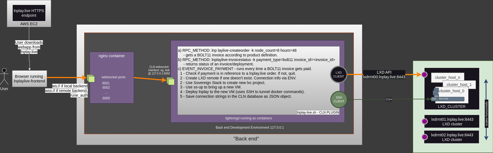

# lnplay.live requirements

This is what we intend to accomplish as a MINIMUM VIABLE PRODUCT for the tabconf-2023 hackathon. `lnplay.live` is a public website allowing anyone to purchase (via lightning-only) an ephemeral regtest lightning environment called [`lnplay`](https://github.com/farscapian/lnplay) that can be used to educate bitcoin meetups, bitcoin conferences, board-rooms, etc. It's a fun an educational experience helpful in orange-pilling your target audience.

# Product Definition

|PRODUCT_SKU|CLN_COUNT|PRICE (sats/node-hour)|MAX_QTY|REQUIRED/OPTIONAL|
|---|---|---|---|---|
|A|8|5 sats|1344|REQUIRED|
|B|16|6 sats|2688|OPTIONAL|
|C|32|7 sats|5376|OPTIONAL|
|D|64|8 sats|10752|OPTIONAL|

Each product is defined by a BOLT12 offer which is used to [fetch](https://docs.corelightning.org/reference/lightning-fetchinvoice) BOLT11 invoices used during checkout. Paid invoices associated with a particular BOLT12 Product SKU determines the CLN_COUNT (and thus VM sizing). These BOLT12 "Product Offers" get embedded into the front-end during build time and are used internally only (i.e., the user never sees the BOLT12 offer).

> Note: Since the Product offers are issued using the [quantity_max] field, the [amount] in the `fetchinvoice` command must be multiplied accordingly.

Once the BOLT11 invoice is paid, the user should be directed to a unique URL based on the transaction `pre_image`. They should be asked to store the URL in their in their password manager.

> OPTIONAL Feature - When the connection information becomes available to the web app, it would be nice for the front-end web app to generate QR codes and or PDF printouts.

## BOLT12 Product Offers

Here's how you create the BOLT12 Product Offers:

```bash
./lightning-cli.sh --id=1 -k offer amount=5sat description="8 node environment." quantity_max=1344  issuer="lnplay.live"
./lightning-cli.sh --id=1 -k offer amount=6sat description="16 node environment." quantity_max=2688  issuer="lnplay.live"
./lightning-cli.sh --id=1 -k offer amount=7sat description="32 node environment." quantity_max=5376  issuer="lnplay.live"
./lightning-cli.sh --id=1 -k offer amount=8sat description="64 node environment." quantity_max=10752  issuer="lnplay.live"
```

# lnplay-frontend [captain: banterpanther]

The front-end is a [lnmessage-enabled](https://github.com/aaronbarnardsound/lnmessage) PWA that interfaces with a backend core lightning node (CLN) over the `--experimental-websocket-port` (HTTP for local, 443/HTTPS/TLS-1.3 for remote hosts). Embedded in the front-end code is a well-known rune that authenticates client requests to the CLN node. The front-end application SHOULD accept this rune AND a list of BOLT12 offers at build-time if possible (see future work).

## Copy

The frontend should have a section which describes the product offering and convinces potential customers to buy.
## Rune

A rate-limited rune and restricted rune needs to [be issued](https://github.com/farscapian/lnplay/blob/tabconf/get_rune.sh) by the back end (admin rune OK for demo). This rune gets embedded in the front-end and is used for authenticating client requests to the backend websocket endpoint. Method authorization should be based on WHITELIST with the following methods: [`fetchinvoice`](https://docs.corelightning.org/reference/lightning-fetchinvoice) and [`waitinvoice`](https://docs.corelightning.org/reference/lightning-waitinvoice), and `lnplaylive-orderstatus`.

# lnplay-backend [captain: farscapian]

The backend consists of the following efforts:

## Infrastructure (REQUIRED) - aka 'cluster'

A LXD cluster providing compute, memory, and storage is accessible at `lxdrmt00.lnplay.live:8443` [LXD API](https://documentation.ubuntu.com/lxd/en/latest/search/?q=API&check_keywords=yes&area=default) (access is IP white-listed). The LXC client in the provisioning plugin accesses this service to create projects, provision VMs, and deploy [`lnplay`](https://github.com/farscapian/lnplay/tree/tabconf).

STATUS: PARTIALLY COMPLETED (service endpoint is in place, but cluster is one host at the moment)

## CLN Provisioning Plugin (REQUIRED)

A cln plugin written in bash with two primary functions:  
  
  a) code that that gets [executed whenever a BOLT11 invoice is paid](https://docs.corelightning.org/docs/event-notifications#invoice_payment). The plugin will determine if the payment is associated with known BOLT12 Product Offer ([example](https://github.com/daGoodenough/bolt12-prism/blob/main/prism-plugin.py)) representing product SKUs. If it is, the following occurs:

     i) when running for the first time, a new [remote](https://documentation.ubuntu.com/lxd/en/latest/reference/manpages/lxc/remote/#synopsis) will need to be created. This is achieved by passing in environment variables and/or using [docker secrets](https://docs.docker.com/compose/compose-file/compose-file-v3/#configs). Assuming the LXD remote connection information is correct and the remote cluster service is up, a new remote will be created and the LXD client will be switched over to it.
     ii) the plugin will create a new LXD [project](https://documentation.ubuntu.com/lxd/en/latest/projects/) and switch to it. The project name includes the expiration date (in unix timestamp).
     iii) the plugin will spin up a new VM using [`ss-up`](https://www.sovereign-stack.org/ss-up/) on a remote LXD cluster using a custom environment file.
     iv) As a last step, the stores the connection strings in the CLN database as a JSON structure, retrievable using (b).
  
  b) a rpcmethod `lnplaylive-orderstatus <pre_image>` that allows the frontend web app to check on the status of an order. This method would take as an argument the payment pre-image and return a JSON document containing connection strings for the deployment. The front end can poll `lnplaylive-orderstatus` and display connection strings when available.

## Integrate front-end into lnplay/tabconf2023 (REQUIRED)

The front-end web app will need to be dockerized and an option added `DEPLOY_LNPLAYLIVE_FRONTEND=true` in `lnplay` for deploying the web-UI at the root of the app.

## Hosting for `lnplay.live` (REQUIRED)

To serve the `lnplay.live` web app to the public, a VM will be created on AWS and `lnplay` will be deployed with `DEPLOY_LNPLAYLIVE_FRONTEND=true`.
### Issuing BOLT12 Offers (REQUIRED)

When creating the [BOLT12 Product Offers](https://docs.corelightning.org/reference/lightning-offer), the amount should be set to the price (in sats per node-hour) as specified in the Product Definition.

Note: The `[quantity]` field is an integer representing ONE NODE HOUR (for 8 nodes running for 2 hour, quantity=16). 

Note: Product customizations (OPTIONAL FOR MVP) MAY be passed to the provisioning script using the [payer_note] field `fetchinvoice` (JSON expected).

## A script that culls instances (OPTIONAL)

Each LXD project name includes the expiration date (in UNIX timestamp). So, a script needs to be created that runs every hour or so that identifies expired projects and prunes them from the LXD cluster. This involves de-provisioning the `lnplay` instance by running [`ss-down`](https://www.sovereign-stack.org/ss-down/).

# Architecture Diagram



# Development Environment

## frontend

Front-end developers can develop however they want. Polar is usually a good choice when running docker. Also check out [this script](https://github.com/ElementsProject/lightning/blob/master/contrib/startup_regtest.sh) in the CLN repo. Another solution is running `lnplay` locally on your dev machine which exposes 5 core lightning nodes to your localhost (`ws://127.0.0.1:6001-6006`).

Backend development requires [`lnplay`](https://github.com/farscapian/lnplay) deployed to a local docker engine. To get the code, run `git clone --recurse-submodules https://github.com/farscapian/lnplay ~/lnplay`. We will be working on the `tabconf` branch. 

## backend

Before making any commits, do a `git stash`, then `git pull`, `git stash pop` then make your commits, then `git push`. Let everyone know you made changes to `tabconf` branch so they can run `git pull`.

# Future work

* Implement [lightningaddress for bolt12](https://github.com/rustyrussell/bolt12address) on the backend, allowing the front-end to dynamically fetch the BOLT12 product offers using names (e.g., product-a@domain.tld). This results in the front-end being completely decoupled from the backend and eliminates the need for build-time paramemter in the frontend.
* Front end generates QR codes from connnection strings, provided as a PDF.
* Allow customer to submit custom branding for wallet and QR codes.
* monitor the load of your various remotes so the front-end webapp can display product availability.
* Provides options on initial coin distribution. Currently, we give each CLN node 100,000,000 sats (i.e., 1 rBTC) (`COIN_DISTRIBUTION=egalitarian`). But we could also replicate the fiat system (`COIN_DISTRIBUTION=political`), or have a poisson distribution, etc. We could also distribute coins in a random way to simulate coin distribution in bitcoin (`COIN_DISTRIBUTION=pow`).
